# CARD F0-EV — screenshot evidence for the F0 runbook-legibility card

**What this closes.** F0 (runbook legibility) was built, merged (`01c88dc`) and accepted
(`docs/STAGE_E_REPORTS/F0-accepted.md`) on **test evidence only**. The stated acceptance bar also
required **screenshot-backed evidence in both themes**, which was never produced. This card produces
it. No acceptance bar is waived retroactively.

**Zero code change.** No application, component, style, test or engine file was touched. Only the
images below and this file were added.

- `anomaly_detector.py` sha256 **before**: `364577c5c8a3014b6c22b72ef7a4048933eb796a87fe1bac8f087eb577a4a876`
- `anomaly_detector.py` sha256 **after**: `364577c5c8a3014b6c22b72ef7a4048933eb796a87fe1bac8f087eb577a4a876` — unchanged.

---

## How these screenshots were produced

Every image is a capture of the **real running itsoc UI** — the production SPA (`web/dist`, built
from this branch) served by `console/serve.py` on `127.0.0.1:8765`, driven by headless Chrome.
Nothing here is a mockup, a hand-drawn image, a synthesized image, or a test-renderer snapshot.

Real data, end to end:

| | |
|---|---|
| Run A (eligible states) | `tests/eval/cases/pos_bruteforce_compromise.log`, analyzed with `python3 log_analyzer.py --rules-only` |
| Run B (drift state) | `tests/eval/cases/pos_disk_85.log`, same command |
| Incident under review | `inc-657e23caabd7` — entity `198.51.100.11`, CRITICAL, rule `auth_bruteforce_success` |

`--rules-only` was used because no LLM endpoint is reachable in this environment. That is the correct
mode here and does not weaken the evidence: rules own severity, correlation and runbook eligibility,
and the runbook card renders **no** advisory content whatsoever. The card's inputs are entirely
rule-owned.

**How the ineligible state was reached — honestly.** The Response panel renders only the runbooks the
engine returned as eligible; an ineligible `RunbookCard` appears in the shipped UI on exactly one
path — a **drift 409**, when `POST /api/approvals` re-evaluates eligibility and the rules now say no.
This was reached with real data, not simulated: the incident page was opened against run A (both
runbooks eligible), the served run was then swapped to run B, and **Request approval** was clicked.
The engine returned a genuine 409 whose `missing` array is rendered verbatim on the card:

```
trigger.rule_ids: none of auth_bruteforce, auth_bruteforce_success, possible_break_in present (incident rules: disk_pressure)
```

Note on the images: a floating Copilot button is fixed to the viewport's bottom-right corner and
clips into the corner of a few element captures. It is an unrelated overlay, not part of the card.

---

## The evidence

### Context — the real page behind the cards

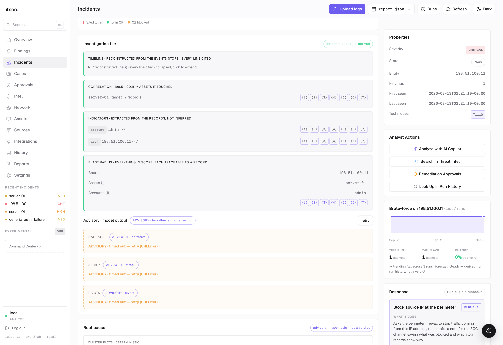
*Light theme: the real Incidents view for `198.51.100.11`, with the Response panel and its runbook cards on the right.*

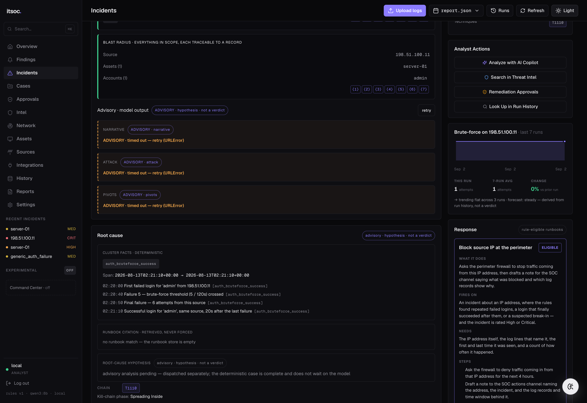
*Dark theme: the same real page and the same real run — note the verbatim log lines in the Root cause panel.*

### Runbook 1 of 2 — `rb-block-ip`, default card surface

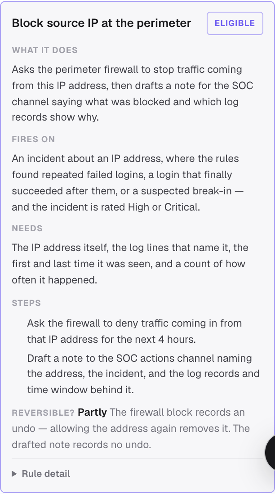
*Light theme: What it does / Fires on / Needs / Steps / Reversible? — all in English, no ids and no severity floor on the default surface.*

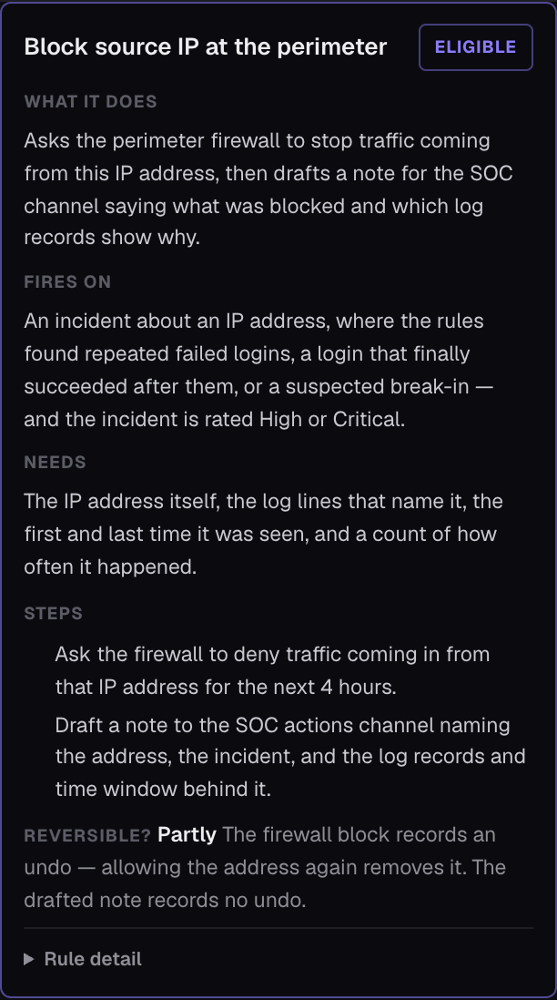
*Dark theme: the same card, same content, unclipped and legible.*

### Runbook 2 of 2 — `rb-draft-notify`, default card surface

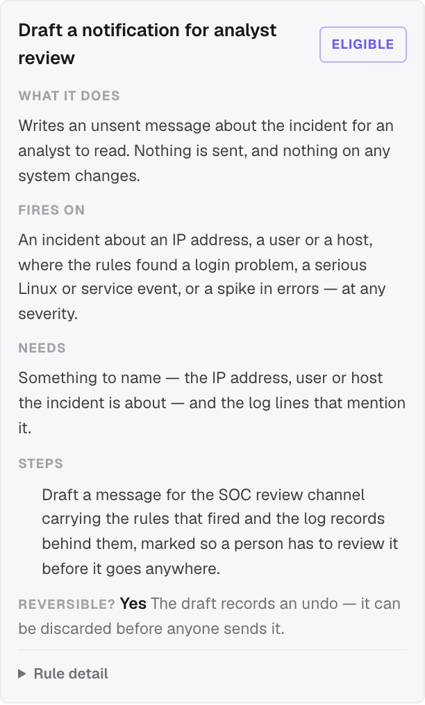
*Light theme: one step, not padded to match rb-block-ip's two; "Reversible? Yes — the draft can be discarded".*

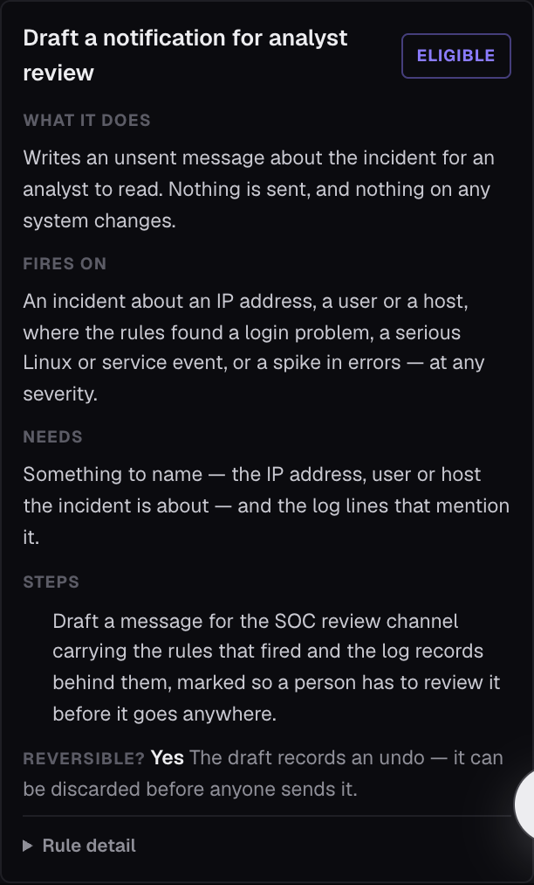
*Dark theme: the same single shipped step, stated plainly ("Nothing is sent, and nothing on any system changes").*

### Disclosure, expanded — eligible card ("Rule detail")

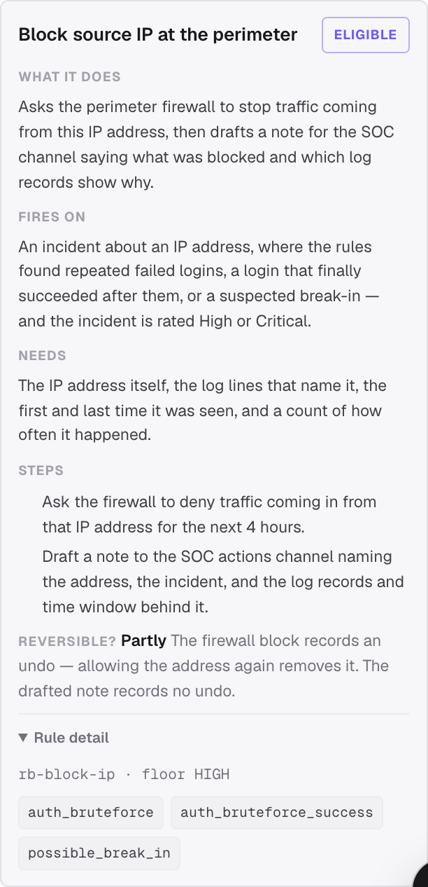
*Light theme: the machine vocabulary — `rb-block-ip · floor HIGH` and the raw trigger rule ids — one click away, never on the default surface.*

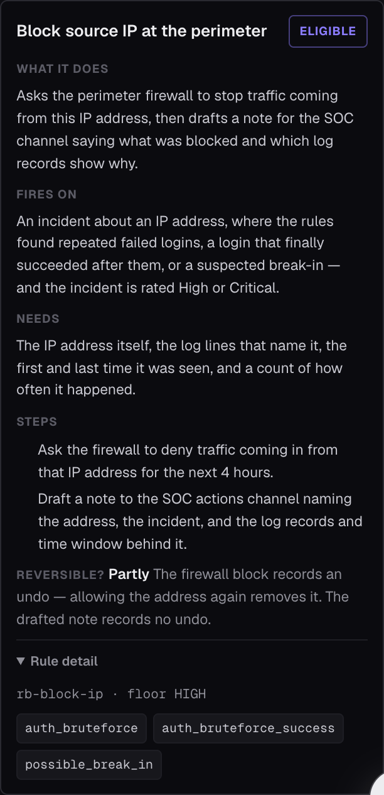
*Dark theme: same disclosure open; the mono rule chips stay readable against the dark ground.*

### Disclosure, collapsed — ineligible card ("Why ineligible?")

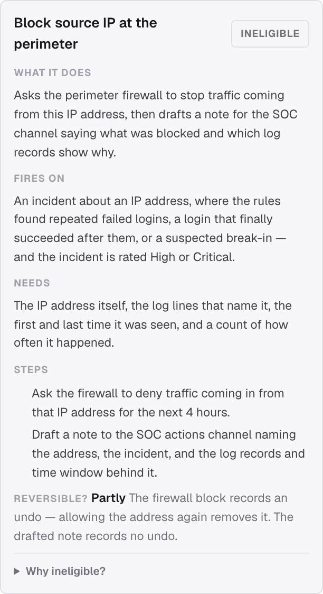
*Light theme: a real drift-ineligible card. The INELIGIBLE badge is muted grey — it never borrows the severity palette — and the disclosure is closed by default.*

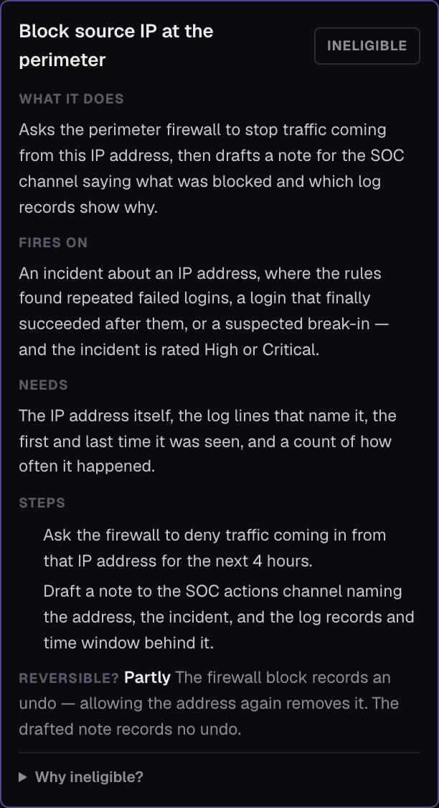
*Dark theme: same state; the badge is still muted, so ineligibility reads as information rather than alarm.*

### Disclosure, expanded — ineligible card

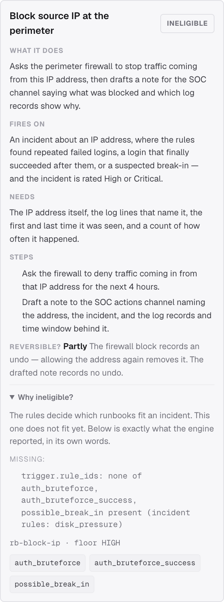
*Light theme: the plain-language lead, then the engine's `missing` array verbatim — no rewording of the rules' own words.*

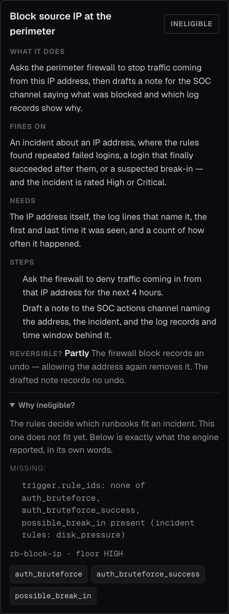
*Dark theme: same verbatim `missing` line, the id and floor, and the trigger rule ids.*

---

## Verdict against the original F0 acceptance bar

### 1. Can a non-builder state what each runbook does, from the card alone? — **YES**

The screenshots carry it. Every word on the default surface is English; the id, the severity floor
and the raw rule ids are all behind a closed disclosure. From the card alone a reader can say:

- **`rb-block-ip`** — asks the firewall to deny inbound traffic from that IP for 4 hours, then drafts
  a note to the SOC actions channel. Fires on an IP incident with repeated failed logins / a login
  that finally succeeded / a suspected break-in, at High or Critical. Only *partly* reversible, and
  the card says why: the firewall block records an undo, the drafted note does not.
- **`rb-draft-notify`** — writes an unsent message for an analyst; nothing is sent and nothing on any
  system changes. Fires at any severity. Reversible: the draft can be discarded.

The honesty discipline survives contact with the real UI: `rb-draft-notify` shows **one** step and is
not padded to two, and the ineligible card reproduces the engine's `missing` array word for word.

### 2. Is each theme legible? — **YES**

Both themes render the full hierarchy at usable contrast in every state captured: section labels,
body prose, the mono blocks inside the disclosure, and the badges. The INELIGIBLE badge is muted grey
in **both** themes and never borrows the crit/high/med/low palette, so an ineligible runbook reads as
a normal state. Nothing is clipped, and no text is lost in either theme.

### 3. One element of the stated bar is **NOT** met: the Steps are not numbered

The F0 scope — and the component's own docstring — says **"numbered Steps"**. In the real UI the
steps render as an **unnumbered** list. This is visible in every card screenshot above: `rb-block-ip`
shows two indented step lines with no `1.` and no `2.`

This is not a rendering artifact of the capture. Computed style on the live page:

```
tag: OL   olDisplay: flex   olListStyleType: none   liDisplay: list-item   markerText: normal
```

The markup is a semantically correct `<ol>`, but `.is-rb-steps__list { display: flex }`
(`web/src/styles/itsoc.css:805`) leaves the CSS reset's `list-style: none` in force, so no marker is
painted — while `padding-left: 17px` still reserves the gutter the markers were meant to occupy.

**Impact — stated plainly, not inflated.** The shipped runbooks have two steps and one step, so
sequence is still conveyed by reading order and no reader is misled. But the acceptance bar said
*numbered*, and as shipped they are not. A follow-up should also weigh that `list-style: none` on an
`<ol>` drops list semantics in Safari/VoiceOver, so the ordering is lost to that reader too.

**Per this card's zero-code-change constraint, this was NOT fixed.** It is reported as a finding.

### Overall

The substantive F0 bar — *a non-builder can state what each runbook does from the card alone, and
each theme is legible* — is **met**, and the screenshots are the proof. One literal element of the
stated bar, **numbered** steps, is **not** met as rendered. The gap is small and cosmetic in impact,
but it is real, it is exactly what screenshot evidence exists to catch, and it should be closed by a
separate one-line CSS card rather than quietly absorbed here.

---

## Gates (all green, all on this branch)

| Gate | Command | Result |
|---|---|---|
| Web tests, runbook tests untouched | `npm --prefix web test` | **43 files, 282 tests passed** |
| Web build | `npm --prefix web run build` | **passed** (1689 modules, built in 1.34s) |
| Detector eval | `python3 tests/eval/run_eval.py` | **20/20 passed, FP=0, FN=0, precision 1.000, recall 1.000** |

`web/src/test/runbook-card.test.tsx` and `web/src/test/c4-themes.test.tsx` are unmodified on this
branch and are inside that green run — confirmed by `git status` showing no changes under `web/`.

**Setup note for the coordinator:** the Orca setup step for this worktree did not run, so
`web/node_modules` was absent. `npm --prefix web install` was run to make the web gates executable.
That touches only the gitignored `node_modules` tree; `web/package.json` and `web/package-lock.json`
are unmodified.
